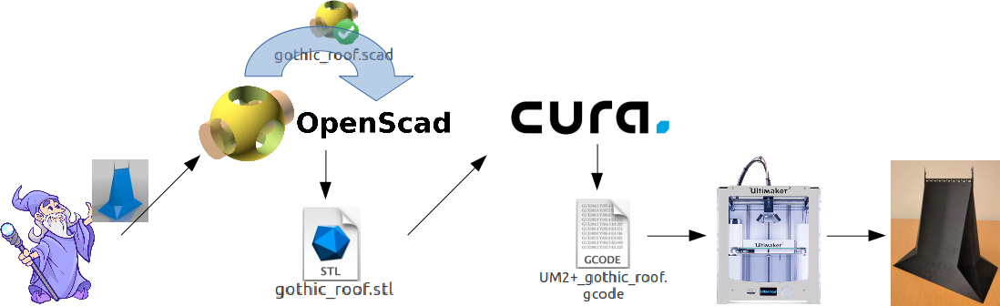

# Course content:
[01 - Intro](01-intro.md)
[02 - 3D-printing](02-3D-printing.md)
[03 - Basic OpenSCAD](03-basicOpenSCAD.md)
[04 - Modules](04-modules.md)
[05 - Trigonometry, conditionals and loops](05-trigonometry_conditionals_loops.md)
[06 - Advanced Functions](06-advancedFunctions.md)

# Intro to 3D design and 3D printing

1. [The 3D design process](#the-3d-design-process)
2. [Why OpenSCAD](#why-openscad)
3. [Tools of the trade](#tools-of-the-trade)

## Before we start:
- Does everyone have OpenSCAD installed?
- And Cura?

## The 3D design process
Imagine a wizard, who is able to conjure up things purely by holding them in his mind and making them physical by willpower alone. 
Designing 3D objects is a bit like that - we describe our objects with code and maths, and make them physical.

1. You start with an __idea for a thing__ - something you want to make.
2. You __make a digital model__ of that thing. The digital model can be in any of a number of formats - in this course we use OpenSCAD.
3. An extruder (the type of 3D printer we work with) is really just a hot glue gun controlled by a computer.
The printer needs specific instructions on where to move the print head and how much material to deposit in each place.
The Gcode format is used for this.
The  programs that make Gcode instructions from models all read the STL file format, so you should __export your model to .stl__.
4. You can import  your .stl file to the Cura program (or a similar program) and  __make a Gcode file__. The Gcode file is what you give the printer.

```
STL (an abbreviation of "stereolithography") is a file format native to the stereolithography CAD software created by 3D Systems.
STL files describe only the surface geometry of a three-dimensional object without any representation of color, texture or other common CAD model attributes.
```


## Why OpenSCAD
OpenSCAD creates designs based on precise measurements or to specific tolerances, that can have moving parts, and use mathematical or procedural information - hence it is great for different scientific applications.
It is very easy to get started with.
It is completely free, and runs on all platforms including mobile phones <https://play.google.com/store/apps/details?id=net.a_z_ia.scadwalk> and the web <http://openscad.net/>.
It is eminently suited for making parametric models. 
Parts can often be reused several times in different ways in the same or other designs, and the possibility for command-line swiches make automated builds possible.
And for the die-hard programmer, OpenSCAD is easy to use with version control systems.

OpenSCAD is unsuited for 3D objects that are ment to be seen rather than printed - like movies (see e.g. <http://www.youtube.com/watch?v=JE1zgCftocc>) or 3D scenes. 
This requires a whole different set of tools, tools that, on the other hand, often makes 3D shapes that cannot be printed because of problems in the geometry. 
They will often turn out to have holes or other problems.

### Parametric design

Parametric modeling uses parameters to define a model - dimensions, for example. 
The parameter may be modified later, and the model will update to reflect the modification. 
Although resizing is one example, a good model will often allow you to change it in more complex ways, 
where requirements to change  different parts of the model in different ways is handled transparently to the user. 
OpenSCAD is eminently suitable for parametric design. Web sites like <https://www.thingiverse.com/> even include hooks to change the model interactively, on the web site, before you download it. 
Our ["Gothic Roof"](https://www.thingiverse.com/thing:2693666) has this possibility. 

### Reusing code

Users can define their own modules and functions. 
This allows grouping portions of script for easy reuse with different values. 
Even when that isn't easy you can often borrow bits of code for use in other places. 
The ["Japanese hirajiro castle"](https://www.thingiverse.com/thing:16862) reuses code extensively - it appears to be a complex model, but is actually fairly simple. 

## Tools of the trade
1. Design
  * Ruler, to measure the real world
  * Design software, like OpenSCAD
  * A protractor can occasionally be a good tool
2. Printing
  * Slicing software, like Cura
  * Knife, to remove finished print from printer 
3. Finishing
  * Knife, to remove supports
  * Plier, also useful to remove  supports
  * File or sand paper to clean prints

[Next slide](02-3D-printing.md)
