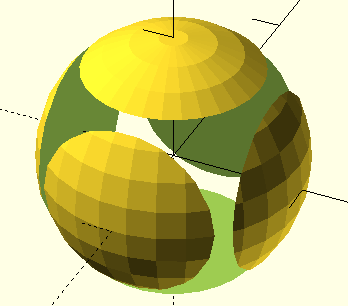

# Basic OpenSCAD operations
1. [Shapes](#shapes)
2. [Constructive Solid Geometry operations](#constructive-solid-geometry-operations)
1. [Transformationss](#transformations)
1. [Documentation and learning resources](#documentation-and-learning-resources)

OpenSCAD is a very powerful language and we cannot cover everything. 
I will just cover a few commands, and usually just the way I usually use it, not all ways it can be used. 
If you encounter code you don't understand, check out the [manual](http://www.openscad.org/cheatsheet/).
After this lesson, you should still be able to model anything you wish.

## Shapes

Open OpenSCAD, and try this:
~~~
// Test cube
cube([50, 10, 5], center=true);
~~~
Press the F5 key to preview your code, or F6 to render it.
Previewing is very fast, but only after rendering will we be able to export to STL. 
Sometimes previewing gives funny results, if so just render instead. 
Everything after "//" is a comment - it is just useful for us humans, it isn't part of the shape.
"cube" is self explanatury, and the numbers give the lengths - X, Y and Z - of the described shape.
Anything within square brackets [] is a vector, and this vector describes the extent of the cube.  
"center" means the figure will be centered in the origin of the coordinate system as opposed to in the first quadrant (try both if you want).

Now add to the above:
~~~
cube([50, 10, 5],c enter=true);
cylinder(d1=10, d2=40, h=50, center=true);
~~~
Again, press F5 to render.
The cylinder is defined with the diameters of both ends, and the height. 
A cylinder will always be centered along the Z azis, but "center" centers the figure along the X,Y plane. 
"center=false" places the cylinder on top of the X,Y plane. 

We can continue adding shapes - try adding a sphere:
~~~
cube([50, 10, 5],center=true);
cylinder(d1=10, d2=40, h=50, center=true);
sphere(r=20);
~~~
Finding bugs in our code when shapes are inside other shapes can be difficult, putting "%" in front of a shape makes it transparent.
Try doing that in front of the line with the sphere.
You can also use "#" to make shapes transparent and red.
These will only work when previewing (F5), not when rendering (F6).

However, we need to be able to combine shapes to make interesting shapes.

## Constructive Solid Geometry operations
Constructive Solid Geometry (CSG) is a modeling technique that uses Boolean operations like union and intersection to combine 3D solids.

We have:

- union() creates a union of all its child nodes.
- difference() subtracts all child nodes from the first one
- intersection() creates the intersection of all child nodes. Only the area shared by all the objects is retained.

Let's try an example:
~~~
/* This is a multi-line comment.
The example is by Marius Kintel
-- <marius@kintel.net>
*/

union() {
    cube(15, center=true);
    sphere(10);
}
~~~
Operators like 'union' use braces '{}'  when their scope covers more than one action.

Try changing union() to difference() and intersection()!

### Try it out
> 
> *Only the sides of a sphere*
>
> Excercise: How can you make a shape that only has the "sides" of the sphere - the sphere minus the cube?
>>~~~
>>difference() {
>>    sphere(10);
>>    cube(15, center=true);    
>>}
>>~~~
>> will do this. The shape we get is a valid shape, but difficult to print succesfully.

## Transformations
Transformations affect the child nodes and transforms them in various ways such as moving, rotating or scaling the child. We will look at three:
- translate([x,y,z]) moves its child elements along the specified vector. 
- scale([x,y,z]) scales its child elements using the specified vector. 
- rotate([deg_x, deg_y, deg_z]) rotates its child a number of degrees about the axis of the coordinate system.

~~~
// Test translation
translate([20, 0, 0]) difference() {
    cube(15, center=true);
    sphere(10);
}

// Test scaling
scale([1, 0.5, 2]) difference() {
    cube(15, center=true);
    sphere(10);
}

// Test rotation - after a translation
translate([-20, 0, 0]) rotate([45, 0, 0]) cube(15, center=true);
~~~

## Documentation and learning resources
The most important resource on the net is IMO the OpenSCAD cheat sheet, at <http://www.openscad.org/cheatsheet/>. 
It is hyperlinked to the on-line manual.
It documents, among other things, several more transformations. 
I _always_ have this open when I model.

I have occasionally gotten important insights looking at other people's code, e.g. code published at <https://www.thingiverse.com/>.

### Try it out
> Excercise: How can you make a flattened sphere with a hole in the middle?
>> Solution: Several possibilities, one is:
>>~~~
>>$fn=50;
>>difference() {
>>   scale ([1, 1, 0.5]) sphere(10);
>>   cylinder(h=10, r=5, center=true);
>>}
>>~~~
>>The "$fn" variable decides the number of fragments in a circle. Keep it below 50 for design work; when finalizing your model you can increase it to get a smooth design.

[Previous slide](02-3D-printing.md)
[Next slide](04-modules.md)
