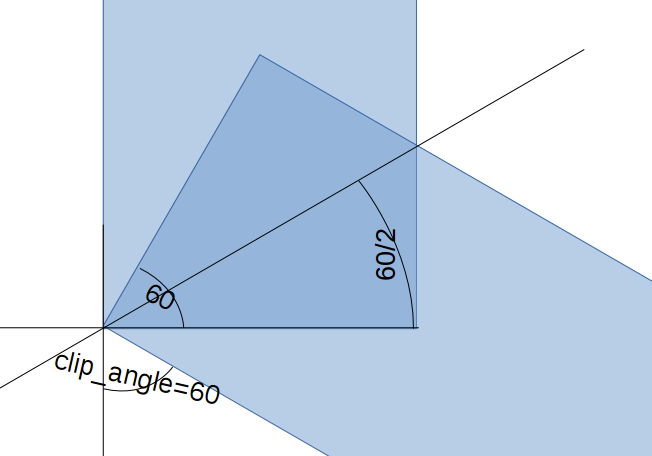

## Trigonometry

We have found it necessary to do some triginometry.
Luckily, [Wikipedia](https://en.wikipedia.org/) has a good section on [trigonometry](https://en.wikipedia.org/wiki/Trigonometric_functions).

For our example, we need to find the correct angle:

Understanding what length we need, and finding the length of the corresponding relevant side:

Using trignometry to find the relevant side:

Cheking with another example to see if this is a generic solution:

This looks great, let's test it in practice:
~~~
/* [Global] */
clip_length=50;
clip_width=10;
clip_height=15;
clip_angle=60; // Vary this to see if it works!

bar_width=4;
bar_insertion_depth=6;

module angle(length, width, height, angle)
    {
        cube([length, width, height], center=false);
        translate([length, 0, 0]) rotate([0,0,angle]) cube([length, width, height], center=false);
    }

module clip()
    {
        difference()
            {
            %angle(clip_length, clip_width, clip_height, clip_angle);
            translate([-((clip_width/2)-(bar_width/2))*tan(clip_angle/2),(clip_width/2)-(bar_width/2),0]) angle(clip_length, bar_width, bar_insertion_depth, clip_angle);
            }
    }

clip();
~~~
All we need to do now is get the vertical placement correct. That, at least, is easy compared to the X-axis trouble. We move it a slight bit up to make vertice placement explicit:
~~~
/* [Global] */
clip_length=50;
clip_width=10;
clip_height=15;
clip_angle=60; // Vary this to see if it works!

bar_width=4;
bar_insertion_depth=6;

/* [Hidden] */
error = 0.01; 

module angle(length, width, height, angle)
    {
        cube([length, width, height], center=false);
        translate([length, 0, 0]) rotate([0,0,angle]) cube([length, width, height], center=false);
    }

module clip()
    {
        difference()
            {
            angle(clip_length, clip_width, clip_height, clip_angle);
            translate([-((clip_width/2)-(bar_width/2))*tan(clip_angle/2),(clip_width/2)-(bar_width/2),clip_height-bar_insertion_depth+error]) angle(clip_length, bar_width, bar_insertion_depth, clip_angle);
            }
    }

clip();
~~~

That is our clip pretty much done! The variables at the top of the script - which plug directly into the API of Thingiverse's web setup - make it easy to make any clip you would want. 

But - what if you would like to set up a shop selling clips in all possible degrees? Let's look at loops.

## Loops
This example is of course construed, but loops are frequently very useful. 

We will modify the "build" module to accept angle as a variable, and make one clip for each angle uo to "clip_angle":
~~~
// New clip module:

error=0.01; // generic "very small number" to avoid non-overlapping objects

module clip(build_angle)
    {
        difference()
            {
            angle(clip_length, clip_width, clip_height, build_angle);
            translate([-((clip_width/2)-(bar_width/2))*tan(clip_angle/2),(clip_width/2)-(bar_width/2),clip_height-bar_insertion_depth+error]) angle(clip_length, bar_width, bar_insertion_depth, build_angle);
            }
    }

// clip();

for (angle = [0:clip_angle]) { 
   translate([clip_length*3*angle, 0, 0])
    clip(angle);
    }
~~~

[Next slide](06-advancedFunctions.md)
