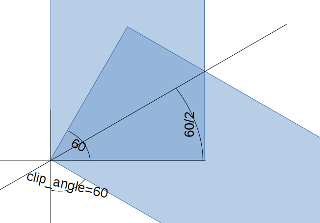
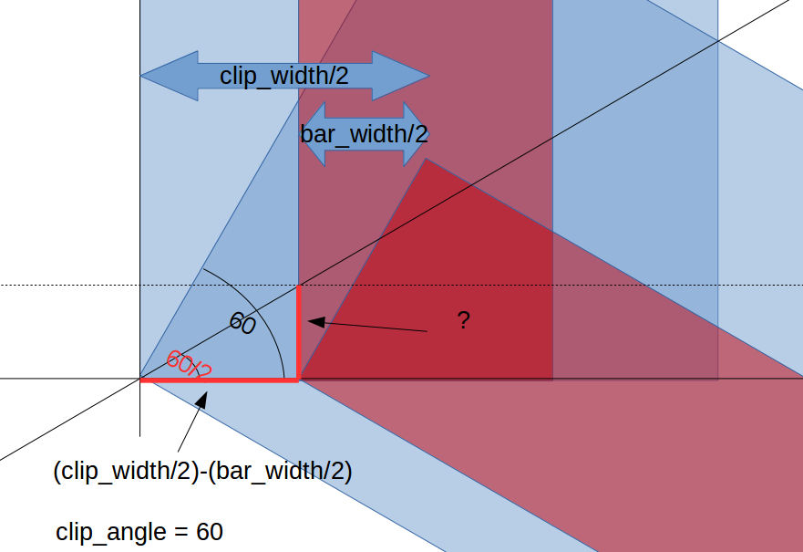
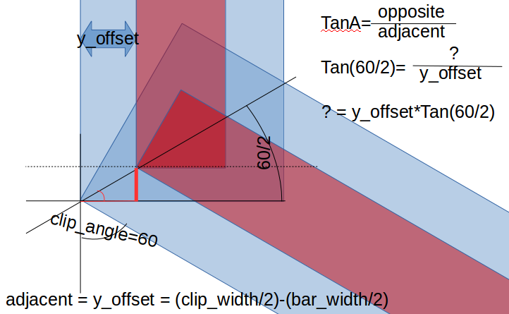
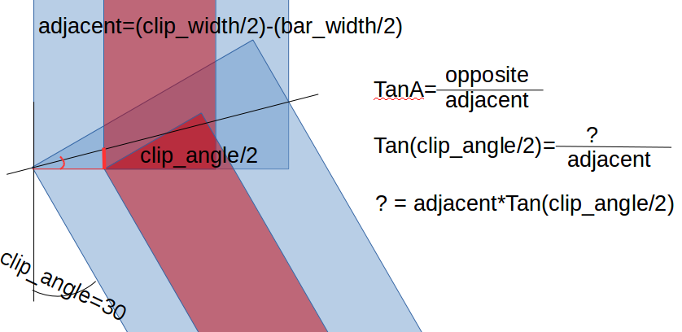

Trigonometry, conditionals and loops
1. [Trigonometry](#trigonometry)
2. [Conditionals](#conditionals)
3. [Loops](#loops)

## Trigonometry

We have found it necessary to do some triginometry.
Luckily, [Wikipedia](https://en.wikipedia.org/) has a good section on [trigonometry](https://en.wikipedia.org/wiki/Trigonometric_functions).

For our example, we need to find the correct angle:

Understanding what length we need, and finding the length of the corresponding relevant side:

Using trignometry to find the relevant side

Cheking with another example to see if this is a generic solution:

This looks great, let's test it in practice:
~~~
/* [Global] */
clip_length=50;
clip_width=10;
clip_height=15;
clip_angle=60; // Vary this to see if it works!

bar_width=4;
bar_insertion_depth=6;

module angle(length, width, height, angle)
    {
        cube([length, width, height], center=false);
        translate([length, 0, 0]) rotate([0,0,angle]) cube([length, width, height], center=false);
    }

module clip()
    {
        difference()
            {
            %angle(clip_length, clip_width, clip_height, clip_angle);
            translate([-((clip_width/2)-(bar_width/2))*tan(clip_angle/2),(clip_width/2)-(bar_width/2),0]) angle(clip_length, bar_width, bar_insertion_depth, clip_angle);
            }
    }

clip();
~~~
All we need to do now is get the vertical placement correct. That, at least, is easy compared to the X-axis trouble. We move it a slight bit up to make vertice placement explicit:
~~~
/* [Global] */
clip_length=50;
clip_width=10;
clip_height=15;
clip_angle=60; // Vary this to see if it works!

bar_width=4;
bar_insertion_depth=6;

/* [Hidden] */
error = 0.01; 

module angle(length, width, height, angle)
    {
        cube([length, width, height], center=false);
        translate([length, 0, 0]) rotate([0,0,angle]) cube([length, width, height], center=false);
    }

module clip()
    {
        difference()
            {
            angle(clip_length, clip_width, clip_height, clip_angle);
            translate([-((clip_width/2)-(bar_width/2))*tan(clip_angle/2),(clip_width/2)-(bar_width/2),clip_height-bar_insertion_depth+error]) 
		angle(clip_length, bar_width, bar_insertion_depth, clip_angle);
            }
    }

clip();
~~~

To get better visualization we move the cut-out up a miniscule amount, hence the "error" variable.

## Conditionals

I sometimes like to mark my things, let's do that here too.

Text length is dependent on text size, fonts and simply what letters you choose so I don't like to make hard requirements around it. 
However, a message when text might be too long could be nice.  

~~~
/* [Global] */
clip_length=50;
clip_width=10;
clip_height=15;
clip_angle=60; // Vary this to see if it works!

bar_width=4;
bar_insertion_depth=6;

text="Arnsteio";

/* [Hidden] */
error = 0.01;

module angle(length, width, height, angle)
    {
        cube([length, width, height], center=false);
        translate([length, 0, 0]) rotate([0,0,angle]) cube([length, width, height], center=false);
    }

module clip()
    {
        difference()
            {
            angle(clip_length, clip_width, clip_height, clip_angle);
            translate([-((clip_width/2)-(bar_width/2))*tan(clip_angle/2),(clip_width/2)-(bar_width/2),clip_height-bar_insertion_depth+error]) 
                angle(clip_length, bar_width, bar_insertion_depth, clip_angle);
            if ( len(text) > (clip_length/10) ) 
			{
				echo("Text length might be too long for the length of your clip!");
			}
            translate([1,0.5,1]) rotate([90,0,0])  linear_extrude(1) text(text, size = clip_height*0.9);
            }
    }

clip();
~~~

That is our clip pretty much done! The variables at the top of the script - which plug directly into the API of Thingiverse's web setup - make it easy to make any clip you would want. 

Designed solid, like this, the clip uses 0.74m of filament (build time 43 minutes) if printed with 5% infill and no raft. 
It uses 0.99m of filament (1 hour 6 minutes build time) if designed hollow and printed with 5% infill, support and a raft. 
The primary reason besides the raft and support waste is that the shell needs to be almost 1mm to be strong enough, and a more complex shape has more shell.
However, small things matter. 
If we dropped the writing we could use thinner walls, and if we in addition could design the clip without end walls, we might come out on top. 
If we also did the work to design optimal build supports we almost certainly would. 

This is the hollow version of the clip (struggling with X placement, need to revisit):
~~~
/* [Global] */
clip_length=50;
clip_width=10;
clip_height=15;
clip_angle=60; // Vary this to see if it works!

bar_width=4;
bar_insertion_depth=6;

text="Arnsteio";

/* [Hidden] */
error = 0.01;

module angle(length, width, height, angle)
    {
        cube([length, width, height], center=false);
        translate([length, 0, 0]) rotate([0,0,angle]) cube([length, width, height], center=false);
    }

module clip()
    {
        difference()
            {
            angle(clip_length, clip_width, clip_height, clip_angle);
            translate([-((clip_width/2)-(bar_width/2))*tan(clip_angle/2),(clip_width/2)-(bar_width/2),clip_height-bar_insertion_depth+error])
                angle(clip_length, bar_width, bar_insertion_depth, clip_angle);
	    	// Making the cutout.
		// length is 2mm shorter to have 1mm end walls.
		// width is 3mm less as the writing cuts 0.5mm into the wall
		// height is chosen so that the "roof" is 1mm thick:	
            translate([1.5*tan(clip_angle/2),1.5, 0])angle(clip_length-2, clip_width-3, clip_height-1-bar_insertion_depth, clip_angle);
            if ( len(text) > (clip_length/10) )
                        {
                                echo("Text length might be too long for the length of your clip!");
                        }
            translate([1,0.5,1]) rotate([90,0,0])  linear_extrude(1) text(text, size = clip_height*0.9);
            }
    }

clip();
~~~

But - what if you would like to print 6 of these clips? Let's look at loops.

## Loops
This example is of course construed, but loops are frequently very useful. 

~~~
for (number = [0:6]) {
   translate([clip_length*2*number, 0, 0])
    clip();
    }
~~~

[Previous slide](04-modules.md)
[Next slide](06-miscellaneousFunctions.md)
