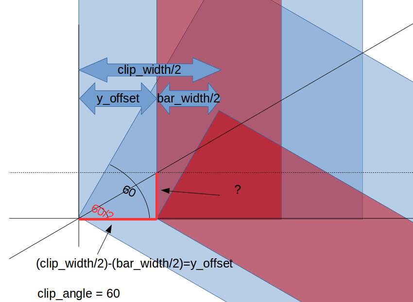

Trigonometry, conditionals and loops
1. [Trigonometry](#trigonometry)
2. [Conditionals, and 2D extrusion](#conditionals-and-2d-extrusion)
3. [Loops](#loops)

## Trigonometry

We have found it necessary to do some triginometry.
When you want to use trigonometry to make rounded or flowing shapes, an interactive graphing calculator like [Geogebra](https://www.geogebra.org/classic) is helpful.
We will not need that today, but we will need some basic trigonometric ratios. 
Luckily, [Wikipedia](https://en.wikipedia.org/) has a good section on [trigonometry](https://en.wikipedia.org/wiki/Trigonometric_functions), and we will use that.

For our example, we need to find the correct angle:

Understanding what length we need, and finding the length of the corresponding relevant side:

Using trignometry to find the relevant side

Cheking with another example to see if this is a generic solution:

This looks great, let's test it in practice:
~~~
/* [Global] */
clip_length=50;
clip_width=10;
clip_height=15;
clip_angle=60; // Vary this to see if it works!

bar_width=4;
bar_insertion_depth=6;

/* [Hidden] */
y_offset=(clip_width/2)-(bar_width/2);

module angle(length, width, height, angle)
    {
        cube([length, width, height], center=false);
        translate([length, 0, 0]) rotate([0,0,angle]) cube([length, width, height], center=false);
    }

module clip()
    {
        difference()
            {
            %angle(clip_length, clip_width, clip_height, clip_angle);
            translate([-y_offset*tan(clip_angle/2), y_offset, 0]) angle(clip_length, bar_width, bar_insertion_depth, clip_angle);
            }
    }

clip();
~~~
All we need to do now is get the vertical placement correct. That, at least, is easy compared to the X-axis trouble. 
To get better visualization we move the cut-out up a miniscule amount, hence the "error" variable.

~~~
/* [Global] */
clip_length=50;
clip_width=10;
clip_height=15;
clip_angle=60; // Vary this to see if it works!

bar_width=4;
bar_insertion_depth=6;

/* [Hidden] */
error = 0.01; 
y_offset=(clip_width/2)-(bar_width/2);

module angle(length, width, height, angle)
    {
        cube([length, width, height], center=false);
        translate([length, 0, 0]) rotate([0,0,angle]) cube([length, width, height], center=false);
    }

module clip()
    {
        difference()
            {
            angle(clip_length, clip_width, clip_height, clip_angle);
            translate([-y_offset*tan(clip_angle/2), y_offset, clip_height-bar_insertion_depth+error]) 
		angle(clip_length, bar_width, bar_insertion_depth, clip_angle);
            }
    }

clip();
~~~

That is our clip pretty much done! 
We can export it to STL now, and prepare it for printing with Cura. 
Or publish it on <http://www.thingiverse.com>.
The variables at the top of the script - which plug directly into the API of Thingiverse's web setup - makes it easy for anyone to make any clip they would want. 
Documentation around the Thingiverse "Customizer" API is at <http://customizer.makerbot.com/docs>.

*A totally different clip made with the same code*

## Conditionals, and 2D extrusion
In addition to doing CSV operations, OpenSCAD can extrude 3d objects from 2d data. 
This is often text, images or vector drawings. 

*QR code to this web page*

*3d-extruded QR code to this web page*

I sometimes like to put text on my things (emboss via `union()` or etch via `difference()`), let's do that here too.

Text length is dependent on text size, fonts and simply what letters you choose so I don't like to make hard requirements around it. 
However, a message when text might be too long could be nice.  

~~~
/* [Global] */
clip_length=50;
clip_width=10;
clip_height=15;
clip_angle=60; // Vary this to see if it works!

bar_width=4;
bar_insertion_depth=6;

text="Arnsteio";

/* [Hidden] */
error = 0.01;
y_offset=(clip_width/2)-(bar_width/2);

module angle(length, width, height, angle)
    {
        cube([length, width, height], center=false);
        translate([length, 0, 0]) rotate([0,0,angle]) cube([length, width, height], center=false);
    }

module clip()
    {
        difference()
            {
            angle(clip_length, clip_width, clip_height, clip_angle);
            translate([-y_offset*tan(clip_angle/2), y_offset, clip_height-bar_insertion_depth+error]) 
                angle(clip_length, bar_width, bar_insertion_depth, clip_angle);
            if ( len(text) > (clip_length/10) ) 
			{
				echo("Text length might be too long for the length of your clip!");
			}
            translate([1,0.5,1]) rotate([90,0,0])  linear_extrude(1) text(text, size = clip_height*0.9);
            }
    }

clip();
~~~

### Solid vs hollow
It is almost always better to design hollow rather than solid.
However, designed solid, like this, the clip uses 0.74m of filament (build time 43 minutes) if printed with 5% infill and no raft. 
The shape attached to the build plate is not complex so a raft should be unnecessary.

I made a fast hollow version, it uses 0.99m of filament (1 hour 6 minutes build time) if printed with 5% infill, support and a raft. 
The primary reason besides the raft and support waste is that the shell needs to be almost 1mm to be strong enough, and a more complex shape has more shell.
But small things matter. 
I had very thick walls (1.2mm) all around to support the text hollowing, but this might not be necessary, and certainly not on walls without text. 
If we in addition could design the clip without end walls, we might come out on top. 
And if we designed optimal build supports we almost certainly would. 
We shall leave this as an exercise for the interested reader :-)

## Loops
What if you would like to print 6 of these clips? Let's look at loops.
This example is of course construed, but loops are frequently very useful. 

~~~
// Exchange last line with this:
for (number = [0:6]) {
   translate([clip_length*2*number, 0, 0])
    clip();
    }
~~~

[Previous slide](04-modules.md)
[Next slide](06-miscellaneousFunctions.md)
