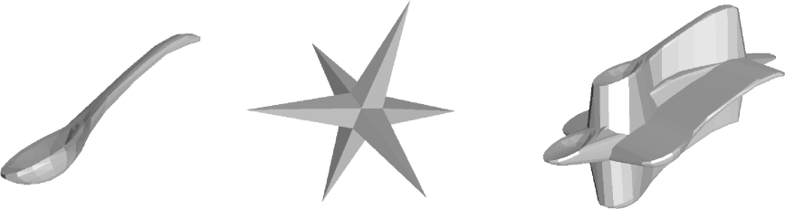

# Miscellaneous other functions

## The incredibly useful Hull()

~~~
/* This example is courtecy of iamwill
(https://cubehero.com/author/orangeroot/)
His blog post at [https://cubehero.com/2013/11/19/know-only-10-things-to-be-dangerous-in-openscad/]
is very good -- arnsteio
*/

union() {
  sphere(r = 20);
  cylinder(h = 30, r1 = 20, r2 = 0);
}
~~~

> However, we want the radius of the cone to match up with the radius of the sphere at a given height we move up the cone. We can use sin and cos to figure that out.
> -- iamwill

~~~
union() {
  sphere(r = 20);
  // See Will's post for extended explanation on the trigonometry
  translate([0, 0, 20 * sin(30)])
     cylinder(h = 30, r1 = 20 * cos(30), r2 = 0);
}
~~~

We can do that, and the code generated is beautiful. But I am lazy, and this gives almost the identical result:
~~~
hull() {
  sphere(r = 20);
  translate([0, 0, 40]) 
     cube(0.01);
}
~~~

## Low $fn for fast modelling of roundish objects
~~~
/* This demonstrates an easy way to model 6-sided towers
The code makes a 6-sided spire with a perfectly round hole ("window") in it. 
- arnsteio, 2017
*/

$fn=6; // This is how our spire gets 6 sides
height=100;
width=20;            
            difference()
            {
                cylinder(h=height, d1=width, d2=0.01);
		// In the next line we redefine $fn for this object to get a perfectly round hole
                translate([0,height/2,height*0.2]) rotate([90,0,0])cylinder(h=height, d=width/3, $fn=50);
            }
~~~

## Rounded squares - the Minkowski way

minkowski() does the [Minkowski sum](https://doc.cgal.org/latest/Minkowski_sum_3/) of child nodes. 

The Minkowski sum of a spoon and a star. Picture by Peter Hachenberger.

~~~
// Try doing the minkowski sum on this example!
$fn=150;
//minkowski()
{
cube([10,10,1]);
sphere(r=2);
}
~~~

## Output to console window
I'm not done with this.
~~~
TestNumber = 5; // This sets the variable "TestNumber" to 5

// Output a string and the value of "TestNumber":
echo("My number is:");
echo(TestNumber);
// This sort of works:
echo("My number is:", TestNumber);
~~~
